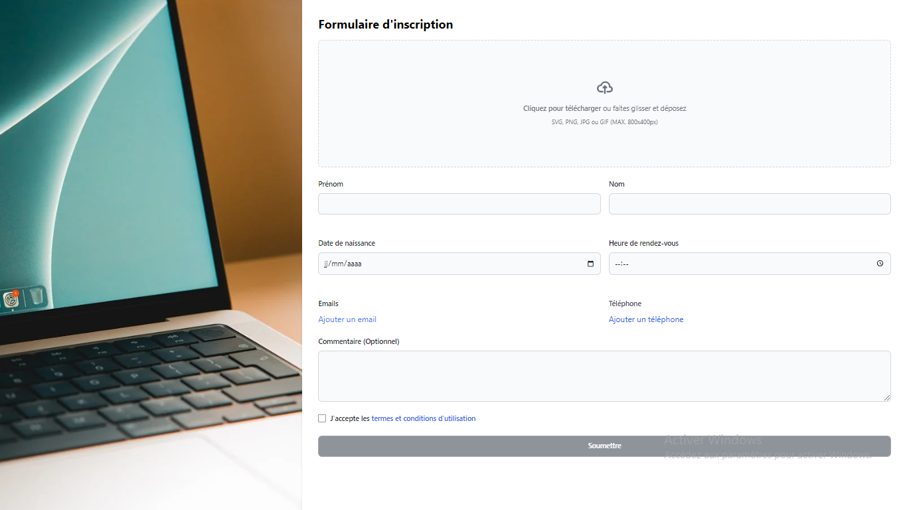

<div align="center">
    
</div>

# React Registration Form with Advanced Validation

This project is a **React-based registration form** that provides advanced form validation, dynamic fields, image preview, and a modern interface styled with Tailwind CSS. It serves as a great starting point for integrating robust forms in any React web application.

The form includes:
- **Dynamic email and phone fields** with options to add or remove inputs.
- **Custom regex validation** for names, email, phone, and address.
- **Appointment time validation** with restricted time slots.
- **Image preview** for profile photo upload.
- **Age validation** ensuring users are at least 18 years old.
- **Interactive success popup** upon submission.

```
If this project helps you, give it a star ⭐ to show your support!
```

## Requirements

To run this project, you need:

- **Node.js** version 18 or higher.
- **React** and **Tailwind CSS** set up in your project.
- **pnpm** or **npm** for dependency management.

## Quick Start

To get started with the form, clone the repository and install the required dependencies:

```bash
git clone https://github.com/Osiris-Balonga/react-registration-form.git
cd react-registration-form
pnpm install
```

Then, start the development server:

```bash
pnpm start
```

## Form Features

This form implements various validation and interactivity features, including:
- **Regex-based validation** for specific fields like name, email, phone, and address.
- **Dynamic field management**, allowing users to add or remove additional email and phone number fields.
- **Age restriction validation** ensuring that users must be at least 18 years old.
- **Time validation** to limit appointment selection within predefined hours.
- **Success popup** that confirms form submission and redirects users to the homepage after submission.
- **Error and success indicators** in form fields for better user experience.

## Digging Deeper

You can explore the form code to learn how the validation logic, dynamic fields, and popup handling are implemented using React hooks and Tailwind CSS.

## License

This project is open source and available under the [MIT License](LICENSE).

## About

This project was created to demonstrate advanced form validation and interactivity in React using best practices and modern design techniques with Tailwind CSS.

---

# Formulaire d'inscription React avec validation avancée

Ce projet est un **formulaire d'inscription basé sur React** qui offre une validation avancée, des champs dynamiques, un aperçu d'image et une interface moderne stylisée avec Tailwind CSS. C'est un excellent point de départ pour intégrer des formulaires robustes dans toute application web React.

Le formulaire inclut :
- **Champs d'e-mail et de téléphone dynamiques** avec des options pour ajouter ou supprimer des entrées.
- **Validation personnalisée avec regex** pour les noms, e-mails, numéros de téléphone et adresses.
- **Validation des créneaux horaires** pour les rendez-vous.
- **Aperçu de l'image** pour la photo de profil téléchargée.
- **Validation d'âge** garantissant que les utilisateurs ont au moins 18 ans.
- **Popup de succès interactive** après la soumission du formulaire.

```
Si ce projet vous aide, donnez-lui une étoile ⭐ pour montrer votre soutien !
```

## Prérequis

Pour exécuter ce projet, vous aurez besoin de :

- **Node.js** version 18 ou supérieure.
- **React** et **Tailwind CSS** installés dans votre projet.
- **pnpm** ou **npm** pour gérer les dépendances.

## Démarrage rapide

Pour commencer à utiliser le formulaire, clonez le dépôt et installez les dépendances requises :

```bash
git clone https://github.com/Osiris-Balonga/react-registration-form.git
cd react-registration-form
pnpm install
```

Ensuite, démarrez le serveur de développement :

```bash
pnpm start
```

## Fonctionnalités du formulaire

Ce formulaire implémente diverses fonctionnalités de validation et d'interactivité, notamment :
- **Validation basée sur des expressions régulières** pour des champs spécifiques tels que le nom, l'e-mail, le téléphone et l'adresse.
- **Gestion dynamique des champs**, permettant aux utilisateurs d'ajouter ou de supprimer des champs d'e-mail et de numéro de téléphone supplémentaires.
- **Validation de l'âge** garantissant que les utilisateurs ont au moins 18 ans.
- **Validation des horaires** pour limiter la sélection des rendez-vous à des créneaux prédéfinis.
- **Popup de succès** confirmant la soumission du formulaire et redirigeant les utilisateurs vers la page d'accueil après soumission.
- **Indicateurs d'erreur et de succès** dans les champs de formulaire pour une meilleure expérience utilisateur.

## Approfondir

Vous pouvez explorer le code du formulaire pour apprendre comment la logique de validation, la gestion des champs dynamiques et le traitement des popup sont implémentés avec les hooks React et Tailwind CSS.

## Licence

Ce projet est open source et disponible sous la licence [MIT License](LICENSE).

## À propos

Ce projet a été créé pour démontrer la validation avancée des formulaires et l'interactivité dans React en utilisant les meilleures pratiques et des techniques de design moderne avec Tailwind CSS.
